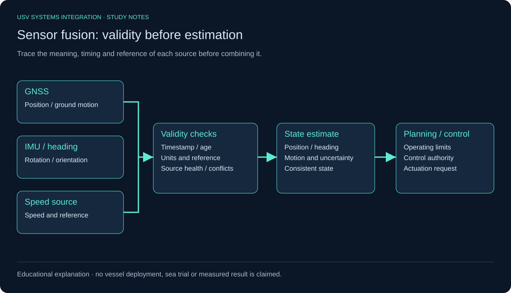
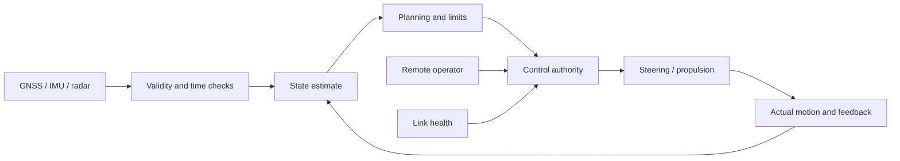
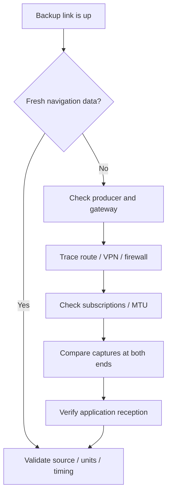

# USV Systems Integration — Study Notes

Structured self-study notes on **Uncrewed Surface Vehicle (USV)** systems integration. The goal is to follow any function from **sensor → state estimate → decision → actuation**, explain where it can fail, and know what evidence proves the cause.

> These are study notes, not a record of field experience. Example values (VLANs, service names, dates, addresses) are hypothetical and chosen for teaching.

**Author:** Mohammed Mahyoub · [Portfolio](https://mahyoub88.github.io/) · [LinkedIn](https://www.linkedin.com/in/mohammed-mahyoub/)

---

## Visual learning guide

Four explanatory diagrams connect the topics below. They are learning aids, not vessel implementation evidence.

- [NMEA 2000 backbone and termination](docs/visual-guide.md#nmea-2000)
- [Sensor validity and fusion](docs/visual-guide.md#sensor-fusion)
- [Network data responsibilities](docs/visual-guide.md#network-data-flows)
- [Integration fault isolation](docs/visual-guide.md#fault-isolation)



## Contents

1. [Terminology: uncrewed, remote-controlled, autonomous](#1-terminology)
2. [The end-to-end system](#2-the-end-to-end-system)
3. [Vessel basics and motion](#3-vessel-basics-and-motion)
4. [Position, heading and speed](#4-position-heading-and-speed)
5. [Sensors](#5-sensors)
6. [Sensor fusion](#6-sensor-fusion)
7. [Autopilot](#7-autopilot)
8. [Heading control](#8-heading-control)
9. [Autopilot fault diagnosis](#9-autopilot-fault-diagnosis)
10. [Firmware updates](#10-firmware-updates)
11. [NMEA 2000](#11-nmea-2000)
12. [PGNs](#12-pgns)
13. [Diagnosing conflicting navigation data](#13-diagnosing-conflicting-navigation-data)
14. [NMEA 0183 and gateways](#14-nmea-0183-and-gateways)
15. [Radar and ARPA](#15-radar-and-arpa)
16. [Deploying vendor files](#16-deploying-vendor-files)
17. [Vessel network and control station](#17-vessel-network-and-control-station)
18. [Primary and backup links](#18-primary-and-backup-links)
19. [Scenario: backup link up, navigation data missing](#19-scenario-backup-link-up-navigation-data-missing)
20. [Linux essentials](#20-linux-essentials)
21. [Time and data validity](#21-time-and-data-validity)
22. [Python for vessel logs](#22-python-for-vessel-logs)
23. [Distance and average speed](#23-distance-and-average-speed)
24. [Path planning and collision avoidance](#24-path-planning-and-collision-avoidance)
25. [COLREGs](#25-colregs)
26. [Power and the marine environment](#26-power-and-the-marine-environment)
27. [Safety and fault response](#27-safety-and-fault-response)
28. [Cybersecurity](#28-cybersecurity)
29. [FAT, SAT and sea trials](#29-fat-sat-and-sea-trials)
30. [Documentation and vendor coordination](#30-documentation-and-vendor-coordination)
31. [Study plan](#31-study-plan)
32. [References](#references)

---

## 1. Terminology

| Term | Meaning |
|---|---|
| **USV** — Uncrewed/Unmanned Surface Vehicle | A surface vessel operating with no crew on board. |
| **Remote-controlled vessel** | Receives control commands from an operator located elsewhere. |
| **Autonomous vessel** | Can perform defined functions and decisions without continuous human input. |

- A vessel can be uncrewed yet fully dependent on a remote operator.
- It can run a pre-programmed route while a human still supervises and intervenes.
- An **autopilot is not full autonomy**. It may hold a heading or follow a track, but obstacle monitoring and collision-avoidance decisions need other systems.
- The IMO uses **MASS** (Maritime Autonomous Surface Ships) for vessels with autonomous or remotely controlled functions. Its focus is on functions, modes of operation, safe operating limits and human oversight.

## 2. The end-to-end system



*Explanatory learning diagram; not a record of a vessel implementation.*


A mission from launch point to work area runs through these steps:

1. Receive the mission and required route.
2. Determine own position, heading and speed.
3. Detect vessels, obstacles and the surrounding environment.
4. Assess whether the route can be executed safely.
5. Select route and speed.
6. Command propulsion and steering.
7. Compare actual motion with commanded motion.
8. Report status to the control station.
9. Change operating mode on a fault or when operating limits are exceeded.

**Functional chain:** sensing → state estimation → situational awareness → planning → control → actual motion → feedback.

Power, communications, safety and logging subsystems run alongside this chain.

The systems integrator ensures every component exchanges the **right data, at the right time, in the right units and reference frames**.

## 3. Vessel basics and motion

| Term | Meaning |
|---|---|
| Bow / Stern | Front / rear of the vessel |
| Port / Starboard | Left / right when facing the bow |
| Rudder | Steering surface on many vessels |
| Thruster | Generates force for propulsion or manoeuvring |
| Draft | Depth of the hull below the waterline |
| Surge / Sway / Heave | Longitudinal / lateral / vertical translation |
| Roll / Pitch / Yaw | Rotation about the longitudinal / transverse / vertical axis |

Steering can come from rudder + engine, from twin engines with independent thrust (differential), or from vectored thrusters. **Control commands therefore differ from vessel to vessel.**

## 4. Position, heading and speed

| Variable | Describes |
|---|---|
| Position | Where the vessel is |
| Heading | Where the bow points |
| COG — Course Over Ground | Actual direction of travel over ground |
| SOG — Speed Over Ground | Speed relative to ground |
| STW — Speed Through Water | Speed relative to the surrounding water |
| Bearing | Direction to a point or target from a reference |
| XTE — Cross Track Error | Lateral deviation from the planned track |

**Example:** the bow points north while a current sets the vessel east. Heading is north, but COG is north-east.

**Heading sources:**
- A **single-antenna GNSS** receiver usually cannot give true heading when stationary. It derives direction of motion only while moving.
- **Multi-antenna GNSS** can provide heading, depending on the device.

When two GPS units "disagree on direction", first ask:
- Is the conflicting value Heading, COG or Position?
- Is the reference True or Magnetic north?

## 5. Sensors

| Sensor | Primary function | Watch for |
|---|---|---|
| GNSS | Position, time, motion | Fix quality, signal loss, interference/jamming, implausible jumps |
| IMU | Acceleration, rotation rates | Accumulated drift, calibration |
| Heading sensor / compass | Bow direction | Magnetic interference, alignment, reference |
| Radar | Targets from reflections | Sea clutter, rain, settings |
| AIS | Data broadcast by equipped vessels | Does not detect all objects or all boats |
| Camera | Visual scene | Lighting, fog, glare, spray |
| LiDAR | Range measurements, point clouds | Device type, range, environmental effects |
| Depth sounder | Water depth below transducer | Mounting position, keel offset |
| Rudder feedback | Actual rudder angle | Zero point, sign convention, calibration |
| Engine sensors | Status, temperature, RPM, pressures | Operating limits, reading validity |

AIS is a **cooperative** system. It does not replace radar and a proper lookout, because carriage requirements do not cover all vessels.

## 6. Sensor fusion

Fusion combines multiple sources to estimate vessel state and environment:
- **GNSS** provides the position reference.
- **IMU** covers fast motion between GNSS updates.
- **Heading sensors** support heading estimation.
- **Radar, cameras and AIS** build the target picture.

Align these before fusing: **time, units, axes, sensor position (lever arms), mounting orientation, measurement quality.**

**Example:** a camera reports a target now while the radar track arrives two seconds late. The system may then believe there are two different targets.

**Kalman Filter / Extended Kalman Filter** estimate state from a motion model and measurements with different uncertainties. They cannot correct bad installation or calibration.

## 7. Autopilot

Typical components: heading and navigation sources, controller, operator interface, rudder actuator or steering system, feedback, communications and power.

| Mode | Function |
|---|---|
| Standby | No automatic steering |
| Heading hold | Maintain a set heading |
| Track control | Follow a navigation route |
| Manual remote control | Execute remote-operator commands through the control system |

Not every unit supports every mode. Entering Track mode may require acceptance or preconditions.

**Commissioning checks:**
- vessel type
- actuator direction
- rudder limits
- feedback
- alignment and calibration
- dockside and sea tests per the manufacturer's procedure

## 8. Heading control

- **Heading error:** a target of 90° with an actual heading of 80° gives an error of 10° to correct.
- **Angle wrap-around:** the difference between 359° and 1° is **2°** via the shortest turn, not 358°.

**PID control:**
- **P** reacts to the present error.
- **I** reacts to accumulated error.
- **D** reacts to the rate of change of error.

**Tuning trade-offs:**
- Too much gain causes oscillation; too little makes correction slow.
- Speed, load, wind, waves and actuator delay all affect performance.
- Rudder gain must be tuned per system through testing. There is no universal value.

## 9. Autopilot fault diagnosis

1. Identify operating mode and target.
2. Check Heading — its source, reference and data age.
3. Compare against a suitable independent source.
4. Compare commanded vs actual rudder angle.
5. Inspect power, actuator and mechanics.
6. Inspect the data network and logs.
7. Review calibration, settings and recent changes.
8. Run a controlled test after the fix.

| Symptom | Worth checking |
|---|---|
| Heading oscillation | Excessive gain, noisy measurement, delay, mechanical issue |
| Steady offset | Alignment, heading reference, compensation |
| Steering command, no movement | Power, actuator, enable signal, mechanical fault |
| Sudden heading jumps | Source switching, interference, invalid data |
| Heading hold works, Track does not | Route data, link, mode, acceptance conditions |

A symptom is a starting point for investigation, not proof of cause.

## 10. Firmware updates

1. Record model, hardware and software versions.
2. Define why the update is needed; read the release notes.
3. Confirm compatibility and the deployment method with the vendor.
4. Back up settings and the current image; prepare a rollback plan.
5. Ensure stable power and a suitable maintenance window.
6. Update using the approved method.
7. Verify version, settings and connectivity.
8. Test the affected functions.
9. Document the result.

Whether vendor coordination is mandatory depends on the product and the contract. It is not a universal rule.

## 11. NMEA 2000

NMEA 2000 is a marine device network based on **CAN**. It is not Ethernet: a device on it has no IP address on that network.

**Topology:** backbone, T-connectors, drop cables to devices, power feed, and a termination resistor at each end.

**Key facts:**
- Typical bit rate: **250 kbit/s**.
- **120 Ω** termination at each end.
- On a powered-down, isolated, correctly terminated network, CAN-H to CAN-L measures about **60 Ω**.
- Cable lengths, voltage drop and load count follow the design rules.

Measure resistance only with power removed, per procedure. A good resistance reading alone does not prove the network is healthy.

## 12. PGNs

A **Parameter Group Number** identifies the type of data group exchanged.

| PGN | Data |
|---|---|
| 127250 | Vessel Heading |
| 127245 | Rudder |
| 129025 | Position, Rapid Update |
| 129026 | COG & SOG, Rapid Update |
| 129029 | GNSS Position Data |
| 128259 | Speed Through Water |
| 128267 | Water Depth |
| 129283 | Cross Track Error |
| 130306 | Wind Data |

Always check each device's transmit/receive PGN list. Knowing a PGN does not mean every device supports it.

## 13. Diagnosing conflicting navigation data

Do not start by disconnecting a device at random.

1. Identify the conflicting variable.
2. Identify each message's source and device identity.
3. Check measurement validity and timing.
4. Check True/Magnetic and units.
5. Check the receiver's source-selection setting.
6. Isolate a source in a controlled way if needed.
7. Verify primary and backup sources.
8. Test behaviour after reconnection and restart.

The fault may be in source selection while the network itself is healthy.

On Linux, **SocketCAN** and `can-utils` (`candump`) capture CAN frames. Raw frames still need NMEA 2000 decoding to be meaningful.

## 14. NMEA 0183 and gateways

| NMEA 0183 | NMEA 2000 |
|---|---|
| Text sentences (RMC, GGA, HDT…) | Binary messages defined by PGNs |
| Talker → listener arrangement | Shared multi-device network |
| Serial link or gateway | CAN-based |

A **gateway** converts or forwards data between networks. It may:
- add latency;
- not support every message;
- change how data is represented.

Test the **meaning, timing and validity** of the data, not just whether messages arrive.

## 15. Radar and ARPA

- **Radar** detects reflections and estimates range and bearing.
- **ARPA** (Automatic Radar Plotting Aid) tracks targets and estimates their motion.
- **CPA** is the closest point of approach.
- **TCPA** is the time to reach the CPA.

**Example:** CPA 0.1 NM with TCPA 4 min calls for prompt assessment. The decision still depends on the environment, data quality and the manoeuvres available.

These estimates depend on own-ship heading and speed data and change when own ship manoeuvres.

**Also study:** gain, sea clutter, rain clutter, target acquisition, lost tracks, relative vs true vectors, and radar alignment.

Never rely on CPA/TCPA alarms alone to judge collision risk.

## 16. Deploying vendor files

A file's extension alone does not define its function. Before deploying an update or configuration file, confirm:
- the vendor;
- the program that reads it;
- the content type;
- the compatible version;
- the target path and permissions;
- how to verify and roll back.

**Common failure causes:** incompatible file, wrong path, permissions, storage space, or a service that did not reload.

**A successful copy is not a successful update.** Verify that the file loaded and that the affected function works.

## 17. Vessel network and control station

Example segmentation (hypothetical):

| VLAN | Purpose |
|---|---|
| 10 | Control |
| 20 | Navigation data |
| 30 | Video |
| 40 | Management & maintenance |

**Topics:** IP, subnetting, gateway, routing, VLAN, firewall, UDP/TCP, multicast, VPN, QoS, MTU.

**Design questions:**
- Who sends to whom?
- Which protocol and port?
- What is the data rate?
- What latency is acceptable?
- What happens on link loss?
- Is there a single point of failure?
- Can video starve control traffic?

A VLAN separates broadcast domains. It is not a complete security policy on its own.

## 18. Primary and backup links

Links may be cellular, radio or satellite, depending on area and mission.

| Metric | Why it matters |
|---|---|
| Latency | Delay of data and commands |
| Jitter | Variation in delay |
| Packet loss | Lost packets |
| Bandwidth | Transport capacity |
| Availability | Service continuity |
| Failover time | Time to switch to the backup path |

- A backup link may carry control and status only, with reduced video quality.
- Two links are not truly independent if they share the same router or power source without mitigation.

## 19. Scenario: backup link up, navigation data missing



*Hypothetical diagnosis workflow. Link reachability alone does not prove application data validity.*


A good exercise in layer-by-layer diagnosis:

1. Confirm the navigation data producer is still running.
2. Check that data reaches the network gateway.
3. Check the sending service.
4. Review the new route, source and destination addresses.
5. Check VPN and firewall.
6. Check UDP/multicast and group subscriptions, if used.
7. Check MTU if packet size is suspected.
8. Capture packets at both ends.
9. Check how the application receives and interprets the data, and its timing.

**A successful `ping` does not prove navigation data flows** — ICMP may pass while application packets are blocked.

```bash
ip -br addr
ip route
ip route get 192.0.2.20
ss -tulpn
sudo tcpdump -ni eth0 host 192.0.2.20
```

## 20. Linux essentials

**Areas to master:** files and directories, users and permissions, processes, services, storage, networking, logs and time.

Example for a hypothetical `vessel-nav.service`:

```bash
systemctl status vessel-nav.service --no-pager

journalctl -u vessel-nav.service \
  --since "2026-04-29 02:45:00" --until "2026-04-29 03:15:00" \
  -o short-iso --no-pager

journalctl -k --since "2026-04-29 02:45:00" --until "2026-04-29 03:15:00" --no-pager

df -h; df -i; free -h; timedatectl
```

If the service stopped at 03:00, look for:
- the preceding error;
- restarts;
- out-of-memory;
- a full disk;
- a lost device or network;
- a config change;
- a scheduled job.

**Preserve evidence before restarting.** A restart may hide the symptom without removing the cause.

## 21. Time and data validity

Data can be correct yet stale. Know these for every data stream:
- the measurement time and the receive time;
- the time zone;
- how devices are synchronised;
- the maximum acceptable data age;
- how duplicate and out-of-order messages are detected.

A control station must not show the last value as current forever. It should mark it **Stale/Invalid** after a defined threshold.

The threshold is set per function: engine, heading and video data need not share the same limit.

## 22. Python for vessel logs

**Fundamentals:** file I/O, lists and dicts, functions, exceptions, time handling, validation, reporting.

| Library | Use |
|---|---|
| `csv` | CSV files |
| `json` | JSON data |
| `datetime` | Time and intervals |
| `pathlib` | Paths and files |
| `logging` | Structured event and error logging |
| `argparse` | CLI options |
| `math` | Calculations |

Prefer `logging` (timestamp, level, message) over scattered `print` calls.

An unfamiliar log format needs a sample, a field schema, units and a time format before you analyse it.

## 23. Distance and average speed

- 1 nautical mile = **1852 m**.
- 1 knot = 1 NM per hour.

**Average speed (kn) = distance (NM) ÷ time (h).**

Example: 3 NM in 30 min gives 3 ÷ 0.5 = **6 kn**.

**Trip analysis from GNSS fixes:**

1. Read fixes and timestamps.
2. Validate coordinates.
3. Sort by time and handle duplicates.
4. Flag gaps and implausible jumps.
5. Compute distance between accepted fixes.
6. Sum distances per leg.
7. Divide by time, according to the report's definition.
8. Output results with data-quality indicators.

**Watch the definitions:**
- Straight-line distance between start and end is not the distance travelled along the track.
- Average speed while moving differs from an average that includes stops.

## 24. Path planning and collision avoidance

- **Global planning** sets the overall route between locations.
- **Local planning** makes near-term adjustments for targets and changing constraints.

**Constraints:** depth vs draft, restricted areas, obstacles, turning radius, stopping distance, wind and current, energy, and communications.

**Methods:** A\*, Dijkstra, RRT, MPC.

Picking an algorithm is not enough. Validate that the path is feasible for the vessel's real dynamics and limits.

## 25. COLREGs

| Rule | Topic |
|---|---|
| 5 | Look-out |
| 6 | Safe speed |
| 7 | Risk of collision |
| 8 | Action to avoid collision |
| 9 | Narrow channels |
| 10 | Traffic separation schemes |
| 13–17 | Overtaking, head-on, crossing, give-way / stand-on |
| 19 | Restricted visibility |

COLREGs cannot be reduced to "if a target appears, turn right". The correct action depends on:
- the encounter type;
- visibility;
- manoeuvrability;
- channels;
- other vessels.

Risk assessment must use all available appropriate information, not scanty information.

## 26. Power and the marine environment

An apparent software fault may be electrical:
- voltage drop;
- a reboot when a load starts;
- corroded connectors;
- water ingress;
- heat;
- poor grounding.

**Study:** power distribution, fuses, DC/DC converters, battery monitoring, load protection, cabling and connectors.

**Approximate endurance = usable energy ÷ average power draw.** Propulsion, sea state, efficiency and reserve margins change the real figure.

## 27. Safety and fault response

Define:
- the operating modes and their limits;
- who holds control authority;
- the conditions for transition to a safe state.

| Condition | The system must be able to determine |
|---|---|
| Link loss | The safe action for the mission and location |
| Heading source loss | Validity of the backup or need to change mode |
| Position loss | Whether the function can continue safely, and limits |
| Low energy | Reduce the mission or return before the reserve is exhausted |
| Radar loss | Impact on monitoring capability and mode |
| Conflicting commands | Source of authority and rejection of unauthorised commands |

Returning or stopping is not automatically safe everywhere. The response is chosen through risk analysis.

**Also study:** watchdog, heartbeat, timeouts, manual override, emergency stop, FMEA.

## 28. Cybersecurity

Security affects motion and data, so it is part of the safety design:
- access control and user privileges;
- secure remote access;
- separating management from operational functions;
- authenticating the source and validity of commands;
- protecting updates and configuration;
- change logging;
- backup and restore;
- testing updates before deployment.

Two limits to keep in mind:
- Encrypting a link does not prove sensor data is correct.
- A healthy sensor does not prove a command came from an authorised operator.

## 29. FAT, SAT and sea trials

| Test | Purpose |
|---|---|
| FAT | Factory / integration-site acceptance against agreed scope |
| SAT | Acceptance after installation on site |
| Harbour tests | Functional checks at the quay |
| Sea trials | Performance under real marine conditions |

**A good test item has:** ID, requirement, preconditions, steps, pass criterion, result, evidence, owner.

**Example:** the primary link drops; the system fails over to the backup; status data continues within an agreed staleness limit; stale commands are never accepted.

**Rules:**
- Do not set limits such as "2 seconds" without a requirement or analysis behind them.
- On failure: log it, fix it, re-test, and check the impact on other functions.

## 30. Documentation and vendor coordination

**Core documents:**
- network diagram;
- device and version inventory;
- IP/VLAN table;
- data flows;
- navigation sources;
- service configurations;
- configuration backups;
- test plans;
- change and fault logs.

The **Interface Control Document (ICD)** defines, for each interface: data type, format, units, reference, timing, validity, and behaviour on loss.

With vendors, agree on:
- who owns the interface;
- who changes the settings;
- which version is compatible;
- who provides test evidence;
- who resolves faults at the boundary between systems.

**Structured troubleshooting order:** identify the situation → make operation safe → gather evidence → isolate → prove the cause → fix → verify → document.

## 31. Study plan

| Stage | Topic | Exercise |
|---|---|---|
| 1 | Vessel & navigation terms | Explain a trip distinguishing Heading, COG, SOG |
| 2 | Sensors & autopilot | Draw the data path; solve drift and oscillation cases |
| 3 | NMEA 2000 & PGNs | Draw a network; map source and receiver for each message |
| 4 | Radar & ARPA | Interpret targets, CPA/TCPA and error sources |
| 5 | Networks & links | Analyse link loss with persistent missing data |
| 6 | Linux | Lab service, logs, and a deliberate failure to investigate |
| 7 | Python | Analyse a synthetic trip; compute distance and speed |
| 8 | Safety & integration | Write an ICD, a FAT/SAT plan and failure cases |

---

## References

- IMO — Maritime Autonomous Surface Ships (MASS); AIS; COLREGs
- NMEA — NMEA 2000 standard
- Garmin — NMEA 2000 installation guide and PGN list
- Raymarine — autopilot commissioning documentation
- Furuno — radar/ARPA target tracking and alarms
- Linux kernel documentation — SocketCAN; `can-utils`; `tcpdump`; `systemd`/`journalctl`
- Python documentation — `logging`
