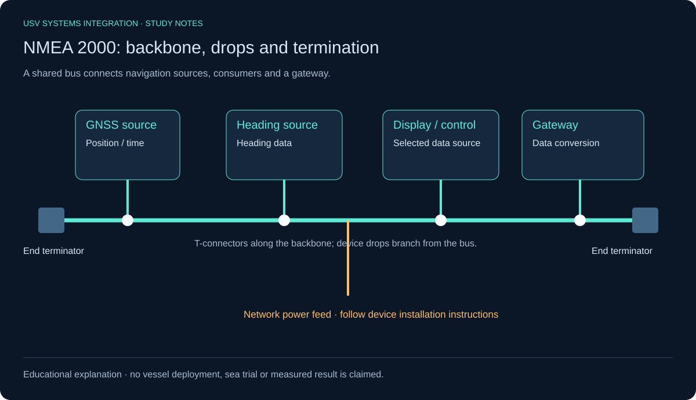
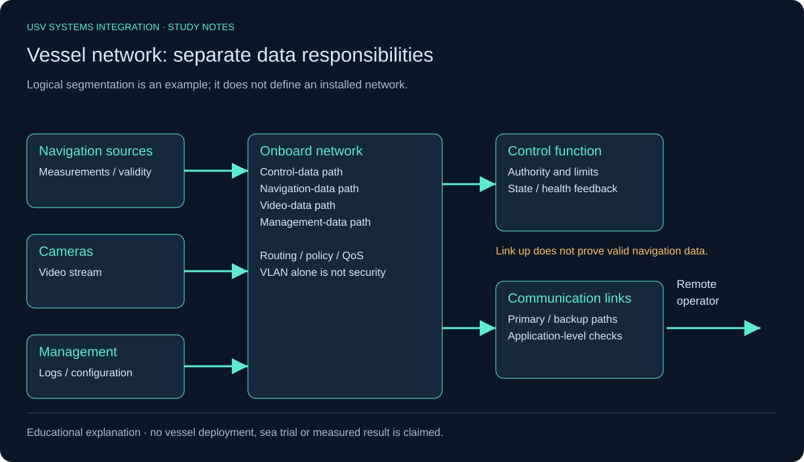
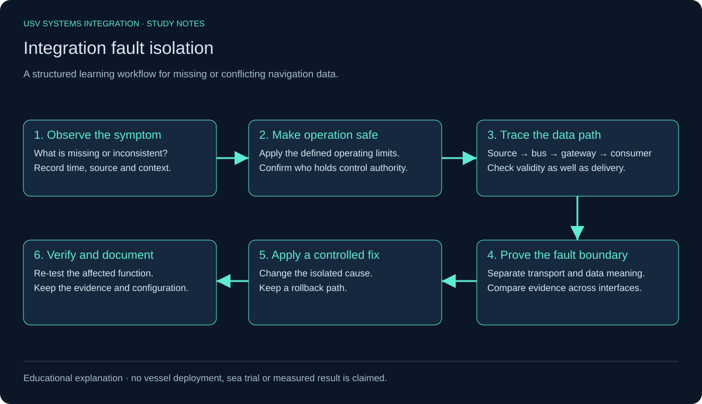

# USV Systems Integration — Visual Study Guide

Educational diagrams based on the accompanying study notes. No deployed vessel, field experience or sea-trial result is claimed.

## NMEA 2000

Two end terminators close the backbone; device drops branch from T-connectors. Power placement, cable lengths and device limits must follow the actual installation documentation. See [Garmin network termination](https://www8.garmin.com/manuals/webhelp/GUID-1415AAD0-FE63-42A6-8F8D-DB713D616122/EN-US/GUID-FABDEBBC-4930-4460-BC64-232E160406E3.html) and [Garmin network fundamentals](https://static.garmincdn.com/pumac/2250_NMEA2000NetworkFundamentals.pdf).

## Sensor fusion

A received measurement can still be stale, have a different reference or conflict with another source. Validate meaning and timing before estimation. The figure explains responsibilities; it does not prescribe a filter implementation.

## Network data flows

Control, navigation, video and management have different service needs. A backup link may be available while its routing, gateway or data source remains wrong. Check the application path rather than the radio status alone.

## Fault isolation

Follow the source-to-consumer path and record evidence at each boundary. An operational fallback must come from the vessel design and approved procedures; these study notes do not prescribe a maneuver.

[Complete study notes](../README.md)
